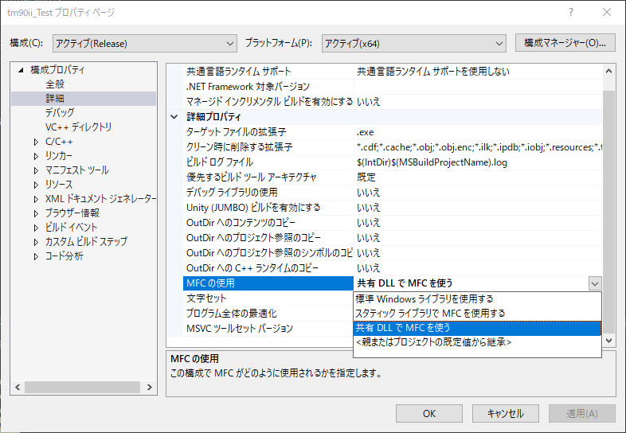

# ofxEpsonAPD

openFrameworks addons to control EpsonPrinter with Epson [AdvancedPrinterDriver](https://partner.epson.jp/support/details/contents022/).  
control with Win32API, so only work on Windows.  

You should install AdvancedPrinterDriver.  

Implements
- available to print Image(ofPixels, ofTexture).
- available to print Text directly.
- available to callback as ofEvent.

## tested on  
- Windows10, of0.11.0~, 64bit Release, [EpsonThermalPrinter TM-T90ii](https://www.epson.jp/products/receiptprinter/tmt902/)(EPSON Advanced Printer Driver Ver.5).

## NOTICE!!!
1. to Build MFC App, select MFC shared dll version.

2. Need to comment out `#include "ofMain.h"` in main.cpp, and  
Need to add `#include"ofxEpsonAPD.h"` before include "ofMain.h"(because of windows.h)  
[reference](https://forum.openframeworks.cc/t/how-to-include-properly-afxwin-h-to-a-vs-project/4329)

## Omake
also included just simple addon, ofxPrinterUtils with Win32API.
- getLocalPrinterNames()
- getPrinterInfo()
